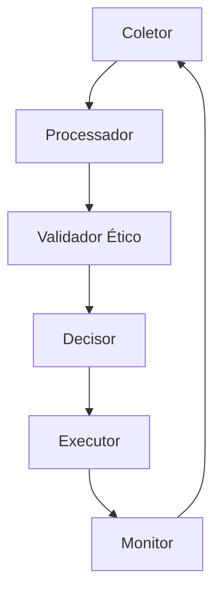

# Arquitetura do Sistema AutoCura

## Visão Geral

O AutoCura é um sistema de IA com capacidade de autocura cognitiva, projetado para operar de forma autônoma e ética. A arquitetura é modular, extensível e baseada em princípios de design limpo e responsabilidades bem definidas.

## Princípios de Design

1. **Modularidade Extrema**
   - Módulos independentes e coesos
   - Interfaces bem definidas
   - Baixo acoplamento

2. **Autocura Cognitiva**
   - Autoavaliação contínua
   - Ajuste dinâmico de parâmetros
   - Aprendizado contínuo

3. **Ética Embutida**
   - Validação ética em todas as decisões
   - Transparência e explicabilidade
   - Conformidade com regulamentações

4. **Observabilidade**
   - Métricas em tempo real
   - Logs estruturados
   - Rastreabilidade completa

## Componentes Principais

### 1. Core

#### 1.1 Interfaces Base
- `BaseProcessador`: Interface para processadores de dados
- `BaseColetor`: Interface para coletores de métricas
- `BaseValidador`: Interface para validadores éticos

#### 1.2 Utilitários
- Gerenciamento de configuração
- Logging estruturado
- Cache distribuído

### 2. Monitoramento

#### 2.1 Coletores
- Métricas do sistema
- Métricas de aplicação
- Métricas de negócio

#### 2.2 Processadores
- Agregação de dados
- Análise temporal
- Detecção de anomalias

#### 2.3 APIs
- REST API
- WebSocket
- gRPC

### 3. Ética

#### 3.1 Circuitos Morais
- Validação de decisões
- Análise de impacto
- Recomendações éticas

#### 3.2 Decisão Híbrida
- Combinação de regras e ML
- Ajuste dinâmico
- Feedback loop

#### 3.3 Fluxo de Autonomia
- Níveis de autonomia
- Controle humano
- Override de decisões

### 4. Diagnóstico

#### 4.1 Análise
- Identificação de problemas
- Análise de causa raiz
- Priorização

#### 4.2 Relatórios
- Dashboards
- Alertas
- Recomendações

## Fluxo de Dados

## Integração

### APIs
- REST para operações CRUD
- WebSocket para eventos em tempo real
- gRPC para operações de alta performance

### Eventos
- Sistema de mensageria
- Pub/Sub
- Event sourcing

### Armazenamento
- Cache distribuído
- Banco de dados temporal
- Armazenamento de logs

## Deployment

### Infraestrutura
- Kubernetes
- Service Mesh
- Load Balancing

### Monitoramento
- Prometheus
- Grafana
- ELK Stack

### Segurança
- Autenticação
- Autorização
- Criptografia

## Escalabilidade

### Horizontal
- Auto-scaling
- Load balancing
- Sharding

### Vertical
- Otimização de recursos
- Cache
- Compressão

## Resiliência

### Circuit Breaker
- Fallback
- Retry
- Timeout

### Cache
- Multi-level
- Invalidation
- Consistency

## Manutenção

### Logs
- Estruturação
- Rotação
- Análise

### Métricas
- Coleta
- Agregação
- Visualização

### Alertas
- Thresholds
- Notificações
- Escalação

## Evolução

### Versionamento
- Semantic versioning
- Backward compatibility
- Migration paths

### Documentação
- API docs
- Architecture decisions
- Runbooks

## Conformidade

### Ética
- Princípios
- Validação
- Auditoria

### Regulamentação
- LGPD/GDPR
- Transparência
- Responsabilidade

## Roadmap

### Fase 1
- Implementação base
- Monitoramento básico
- Validação ética

### Fase 2
- Autocura avançada
- Diagnóstico automático
- Integração completa

### Fase 3
- IA generativa
- Autonomia expandida
- Evolução contínua 