# Arquitetura do Módulo de Integração

Este documento descreve a arquitetura do módulo de integração do sistema de autocura.

## 🏗️ Visão Geral

O módulo de integração é responsável por gerenciar a comunicação entre os diferentes componentes do sistema de autocura. Ele implementa um padrão de mensageria assíncrona com suporte a múltiplos protocolos e formatos.

```mermaid
graph TD
    A[Cliente] -->|HTTP/WebSocket| B[Gateway]
    B -->|Mensagem| C[Processador]
    C -->|Evento| D[Broker]
    D -->|Notificação| E[Consumidores]
    E -->|Ação| F[Sistema]
```



## 🧩 Componentes

### Gateway

```python
class Gateway:
    def __init__(self, config: GatewayConfig):
        self.config = config
        self.adapters = {}
        self.translators = {}
        self.processors = {}

    async def start(self):
        for protocol in self.config.protocols:
            adapter = self.create_adapter(protocol)
            await adapter.start()
            self.adapters[protocol] = adapter

    async def stop(self):
        for adapter in self.adapters.values():
            await adapter.stop()
```

### Processador

```python
class MessageProcessor:
    def __init__(self, broker: MessageBroker):
        self.broker = broker
        self.handlers = {}

    async def process(self, message: Message):
        handler = self.get_handler(message.type)
        result = await handler.handle(message)
        await self.broker.publish(result)
```

### Broker

```python
class MessageBroker:
    def __init__(self, config: BrokerConfig):
        self.config = config
        self.producers = {}
        self.consumers = {}

    async def publish(self, message: Message):
        producer = self.get_producer(message.topic)
        await producer.send(message)

    async def subscribe(self, topic: str, handler: Callable):
        consumer = self.get_consumer(topic)
        await consumer.start(handler)
```

## 🔄 Fluxos

### Processamento de Mensagem

1. Cliente envia mensagem via HTTP/WebSocket
2. Gateway recebe e valida a mensagem
3. Processador processa a mensagem
4. Broker publica o resultado
5. Consumidores recebem e executam ações

### Notificação de Evento

1. Sistema gera evento
2. Broker publica evento
3. Consumidores recebem notificação
4. Ações são executadas
5. Resultado é registrado

## 📦 Dependências

### Internas

- `core`: Módulo central do sistema
- `monitoramento`: Coleta de métricas
- `diagnostico`: Análise de problemas
- `gerador`: Geração de ações
- `executor`: Execução de ações

### Externas

- `fastapi`: Framework web
- `redis`: Cache e pub/sub
- `kafka`: Mensageria
- `pydantic`: Validação de dados
- `prometheus`: Métricas

## 🔒 Segurança

### Autenticação

```python
class AuthMiddleware:
    def __init__(self, config: AuthConfig):
        self.config = config
        self.validator = JWTValidator(config.secret)

    async def __call__(self, request: Request, call_next):
        token = self.extract_token(request)
        if not token:
            raise HTTPException(status_code=401)
        
        try:
            payload = self.validator.validate(token)
            request.state.user = payload
        except:
            raise HTTPException(status_code=401)
        
        return await call_next(request)
```

### Autorização

```python
class RBACMiddleware:
    def __init__(self, config: RBACConfig):
        self.config = config
        self.roles = config.roles

    async def __call__(self, request: Request, call_next):
        user = request.state.user
        role = self.roles.get(user.role)
        
        if not role or not role.can_access(request.path):
            raise HTTPException(status_code=403)
        
        return await call_next(request)
```

## 📊 Monitoramento

### Métricas

```python
class MetricsCollector:
    def __init__(self):
        self.messages_processed = Counter(
            'messages_processed_total',
            'Total de mensagens processadas',
            ['protocol', 'status']
        )
        
        self.processing_time = Histogram(
            'message_processing_seconds',
            'Tempo de processamento',
            buckets=[0.1, 0.5, 1.0, 2.0, 5.0]
        )
```

### Logs

```python
class LoggingMiddleware:
    def __init__(self, config: LoggingConfig):
        self.config = config
        self.logger = setup_logger(config)

    async def __call__(self, request: Request, call_next):
        start_time = time.time()
        
        try:
            response = await call_next(request)
            duration = time.time() - start_time
            
            self.logger.info(
                "Request processed",
                extra={
                    "path": request.url.path,
                    "method": request.method,
                    "status": response.status_code,
                    "duration": duration
                }
            )
            
            return response
        except Exception as e:
            self.logger.error(
                "Request failed",
                extra={
                    "path": request.url.path,
                    "method": request.method,
                    "error": str(e)
                }
            )
            raise
```

## 🔄 Resiliência

### Retry

```python
class RetryMiddleware:
    def __init__(self, config: RetryConfig):
        self.config = config

    async def __call__(self, request: Request, call_next):
        for attempt in range(self.config.max_retries):
            try:
                return await call_next(request)
            except Exception as e:
                if attempt == self.config.max_retries - 1:
                    raise
                await asyncio.sleep(self.config.backoff(attempt))
```

### Circuit Breaker

```python
class CircuitBreaker:
    def __init__(self, config: CircuitBreakerConfig):
        self.config = config
        self.failures = 0
        self.last_failure = None
        self.state = "closed"

    async def execute(self, func):
        if self.state == "open":
            if self.should_retry():
                self.state = "half-open"
            else:
                raise CircuitBreakerOpen()

        try:
            result = await func()
            if self.state == "half-open":
                self.state = "closed"
                self.failures = 0
            return result
        except Exception as e:
            self.failures += 1
            self.last_failure = time.time()
            if self.failures >= self.config.threshold:
                self.state = "open"
            raise
```

## 📚 Referências

- [Clean Architecture](https://blog.cleancoder.com/uncle-bob/2012/08/13/the-clean-architecture.html)
- [Event-Driven Architecture](https://martinfowler.com/articles/201701-event-driven.html)
- [Microservices Patterns](https://microservices.io/patterns/index.html)
- [12-Factor App](https://12factor.net/)
- [SOLID Principles](https://en.wikipedia.org/wiki/SOLID) 